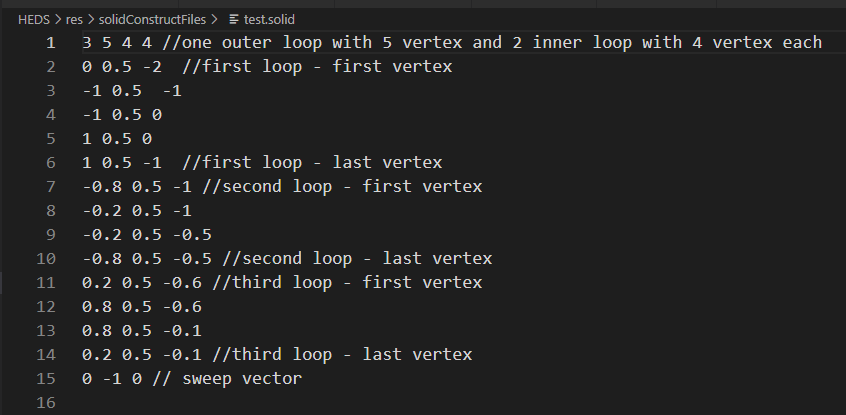
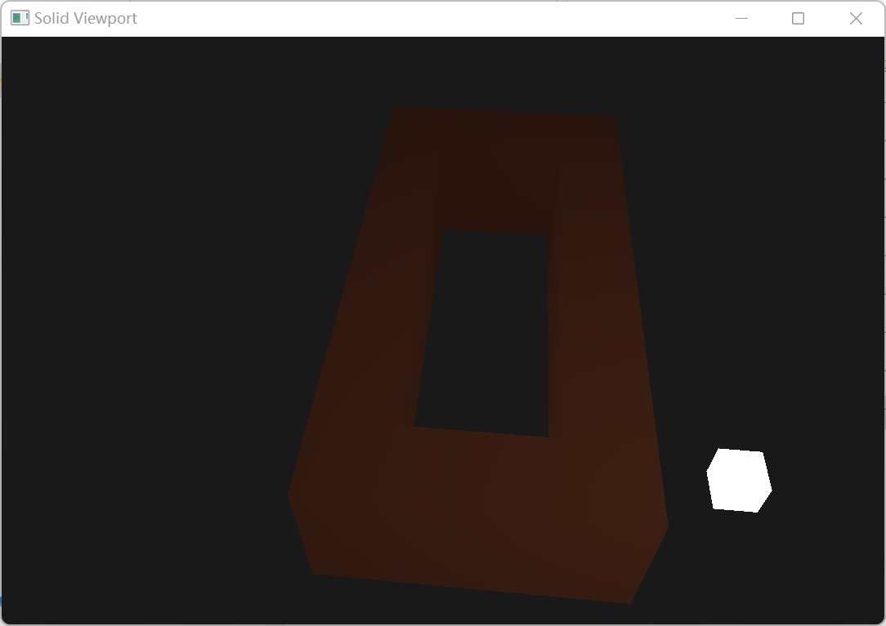
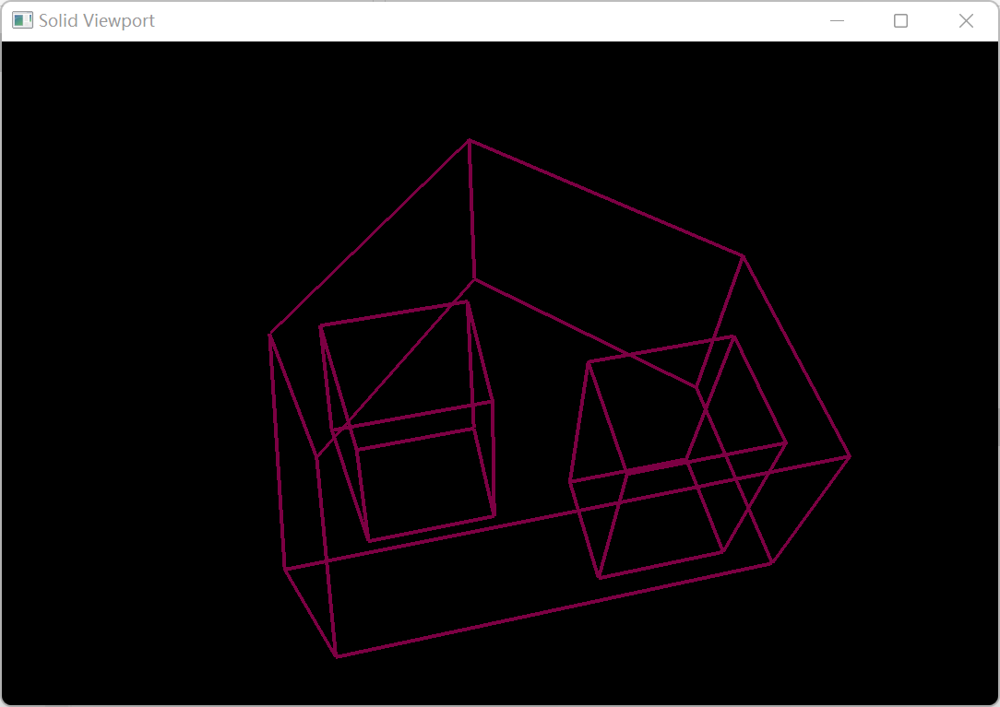
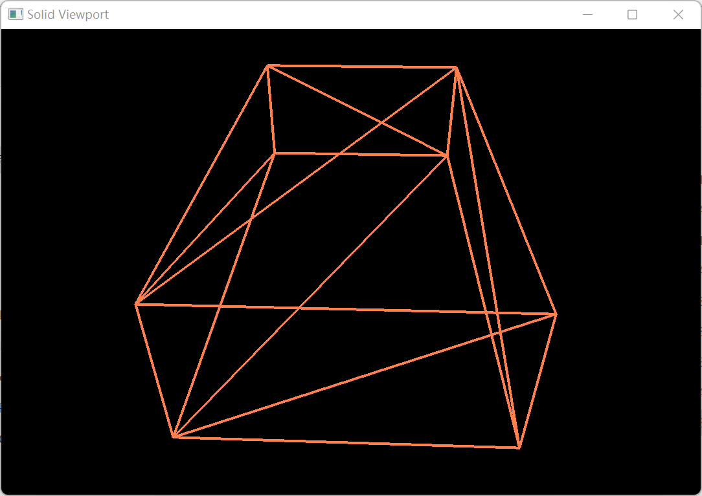

# CAD大程作业

贺云鹏 22121031

https://github.com/Neo2YX/B-rep-Sweep-operation

## 程序使用

编译好的程序在HEDS/HEDS.exe

程序自带两个内置函数用于展示（cube、 zero）
输入1 ： 展示cube
输入2 ： 展示zero（带一个内环）

程序同时支持由文件（HEDS/res/solidConstructFiles/test.solid）生成实体并展示，可以修改此文件以改变生成的实体
输入0 ： 由文件生成实体并展示

## 展示界面操作

W A S D  -  控制相机的前后左右移动
E Q  -  分别控制相机的上升与下降
鼠标  - 控制相机视角的移动
F1  -  将视图切换为光照模式（default）
F2  -  将视图切换为非光照模式
F3  -  将视图切换为三角形绘制线框模式
F4  -  将视图切换为实体线框模式
ESC  -  退出程序

## 程序编译

windows和linux都可以通过cmake进行编译
```
cd build
cmake ..
cmake --build .
```
程序无外部依赖库，使用的GLAD、GLFW、GLM、poly2tri库均在内部链接好

## test.solid文件格式
文件位置为：HEDS/res/solidConstructFiles/test.solid
此文件用来阐述一个面，之后通过sweep操作产生一个实体， 格式如下：

>line 1         - numLoop numVertex1 numVertex2 ... numVertexn //numLoop - 此面的环的数量， 以及每个环的顶点数
line (2-n)      - x y z  //每个顶点的坐标位置
final line      - x y z  //sweep的vector坐标



## 结果图片



